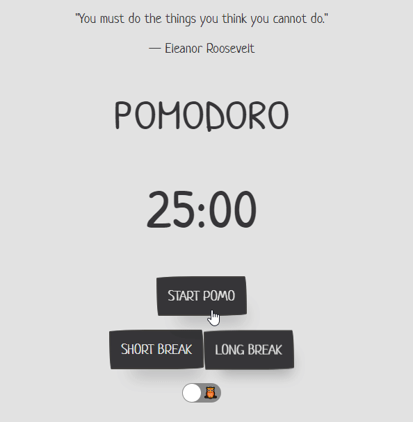

## React Pomodoro Timer 
A simple Pomodoro Timer with dark mode for night owls! Comes with a new inspirational quote every time you visit :)

Created: May 4th 2020

  <a href="https://kien-pomodoro-timer.netlify.app/">Live Demo</a>

  

## 👨‍🎓What I learned:

- Practicing building applications with React Hooks, including useState and useEffect
- Practicing fetching API's in useEffect Hook and displaying data on the DOM
- Learned how to create a countdown using setInterval
- Explored [Emotion styled components](https://emotion.sh/docs/introduction) and used Global Styles to create a dark mode theme

